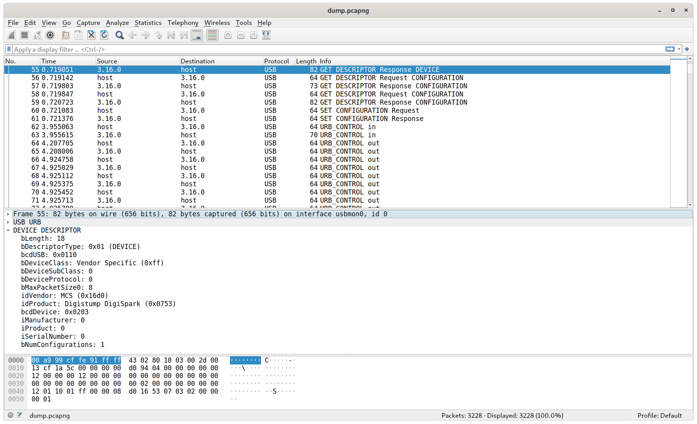
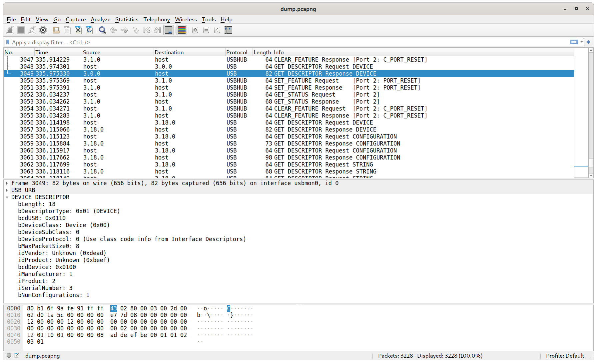
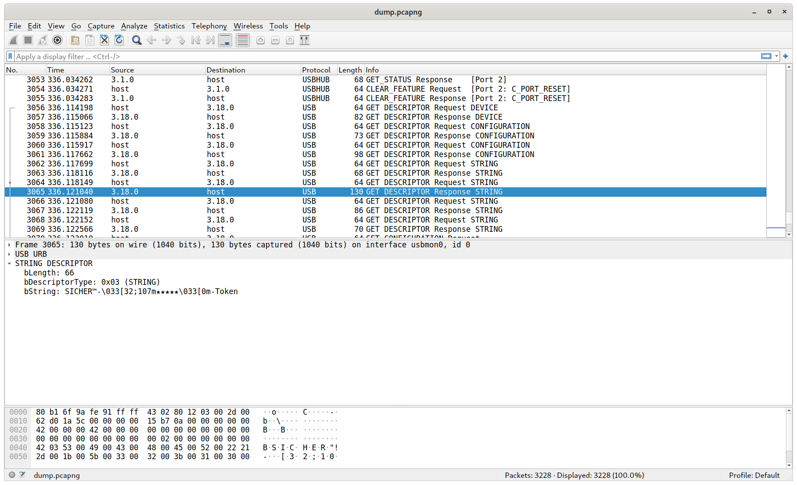
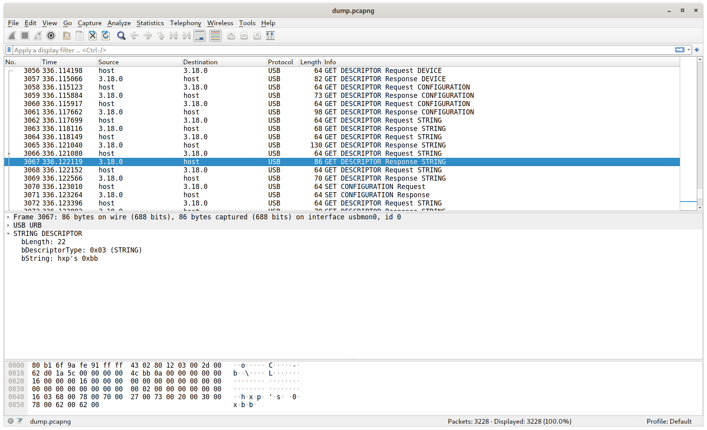
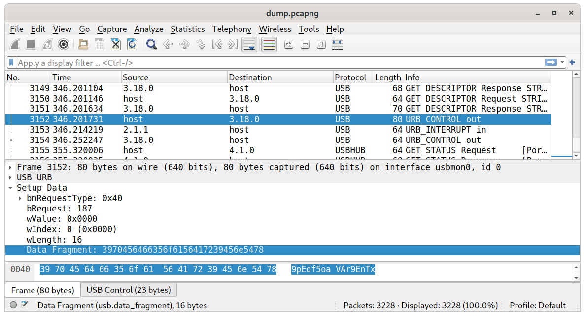
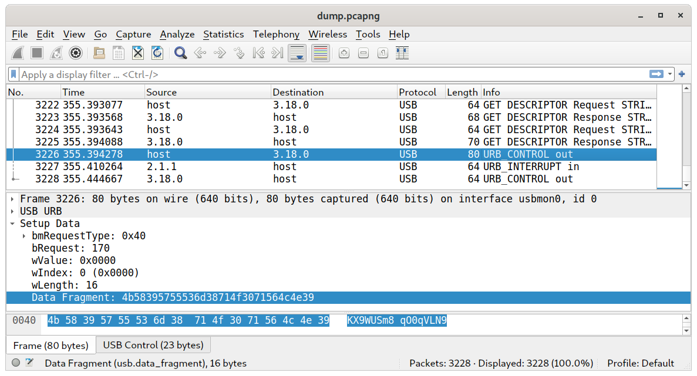
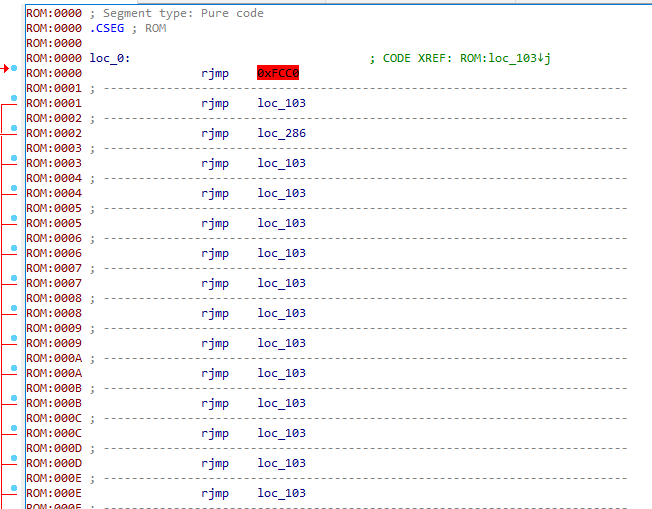
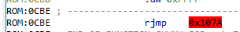

36C3CTF Token of HXP writeup
============================

[spq](https://twitter.com/__spq__) and [I](https://twitter.com/G33KatWork) spent about 48 hours solving this challenge (with 2 sleepful nights inbetween) even though we weren't sure if we wanted to play the CTF at all and if we do, play very casually. That worked out...

The challenge
-------------

You were able to connect to a prompt using netcat. This prompt gave you a challenge and asked for a username. If the username was wrong, the connection was closed.

If you enter the correct username, it asks for a password. Again, if it's wrong the connection is closed.

If you also got that right, it asked for an OTP token. If you got the token correct, you got a flag.

There also was an archive supplied with the challenge. After downloading it, we only found a pcap with a bunch of USB transfers in there. After scrolling through we were able to see a device enumerating followed by *a lot* of USB control requests.



Wireshark is nice enough to look up the VID/PID combination in some database and tell us what kind of device that is, however we didn't see that at first and looked more closely at the control requests.

After all the control requests, this device vanished from the bus another device enumerated. This time with some string descriptors and a completely different behaviour. Generally the device seems to enumerate a few times and vanish again, most likely because code is still somewhat in a broken state and the device crashes and gets reset a few times. We'll get to that later.





This device is the device we really want to talk with. Further below we can see two more control requests to that newly enumerated device which seem to send 2 random looking strings to the device. The request type is 0x40 for both which means this is a vendor specific device request, so it's not defined in any standard but made up by the device "manufacturer". The `bRequest` contains a number defining what exact vendor request should be executed. In our case it's `0xbb` in the first request and `0xaa` in the second.

For control requests `wIndex` and `wValue` can contain some data for the request. These fields don't seem to be used here as they are just 0. The the length of the additional data follows in `wLength` which is followed by the 2 random looking strings. We can conclude that these two requests are just to send these two 16 byte strings to the device.




This is all the interaction with the device we can see in that pcap. Everything inbetween is bus management, enumeration, USB hub stuff etc.

Getting the firmware
--------------------

The massive amount of control requests in the beginning led to the conclusion, that this is some bootloader traffic which contains the firmware being flashed onto the microcontroller. After some careful and intense staring at the different requests, we saw 4 different control requests with `bRequest` values of 0 to 3.

The first one was an IN transfer with `bRequest` set to 0. The device replied with 6 bytes of data which turned out to be a device identification string sent by the bootloader to the host.

Then a `bRequest` type 2 request was sent to the device only once in the beginning without any data.

Following that the interesting stuff happened:

A type 1 request was always followed by 16 type 3 requests. Let's take a closer look at two of the type 1 requests:

The first:
```
Setup Data
    bmRequestType: 0x40
    bRequest: 1
    wValue: 0x0040
    wIndex: 0 (0x0000)
    wLength: 0
```

The second:
```
Setup Data
    bmRequestType: 0x40
    bRequest: 1
    wValue: 0x0040
    wIndex: 64 (0x0040)
    wLength: 0
```

We can see that wValue stays at `0x40` and wIndex is increased by `0x40`. This looks like an address and a length.

Let's check out a few type 3 requests:
```
Setup Data
    bmRequestType: 0x40
    bRequest: 3
    wValue: 0xccbf
    wIndex: 49409 (0xc101)
    wLength: 0

Setup Data
    bmRequestType: 0x40
    bRequest: 3
    wValue: 0xc283
    wIndex: 49407 (0xc0ff)
    wLength: 0
```

`wValue` and `wData` contain structured but at the same time random looking data. All of them start with 0xc for example. That coooould be a vector table for some microcontroller.

Both `wValue` and `wIndex` are 16 bits long. This means we can transmit 4 bytes of suspected firmware data per type 3 request. And `16 (requests) * 4 (bytes per request) = 64 = 0x40` which is what we saw in the `wValue` field of the preceding type 1 request. Also the `wIndex` field in that type 1 request increases by `0x40` bytes which makes sense because especially at the beginning the firmware is linearly stored in flash without any holes.

To conclude: The type 1 requests instruct the bootloader to write the following 0x40 bytes from the following type 3 requests to a specific offset in the flash.

I clicked together a wireshark filter expression to just select the interesting packets containing the firmware so that we could export them out of wireshark and write them to a JSON file:

```
usb.endpoint_address == 0x00 && usb.bus_id == 3 && usb.device_address == 16 && usb.bmRequestType == 0x40
```

sqp wrote a hacky script which parsed the flash offsets and the data out of the JSON file and wrote it to a binary file for disassembly.

Analyzing the firmware
----------------------

We still didn't know what we looked at. It was some firmware, it contained some strings which we used to determine the byte order of the fields in the USB requests, but we didn't know what CPU it was. Turned out one of the strings (`ATtinyL0v3r69`) was indeed the username the prompt expected.

I tried [cpu_rec](https://github.com/airbus-seclab/cpu_rec) which only spit out `8051`. Disassembling the firmware in IDA didn't yield any meaningful results.

spq then went through the USB transfers and saw the DigiSpark USB VID/PID combination. After some googling, I found the [board](http://digistump.com/products/1), that it used an [ATtiny85](https://ww1.microchip.com/downloads/en/DeviceDoc/Atmel-2586-AVR-8-bit-Microcontroller-ATtiny25-ATtiny45-ATtiny85_Datasheet.pdf) and also the [bootloader](https://github.com/micronucleus/micronucleus/tree/master/firmware). Yay!

Using that code, I was able to confirm our initial guess about how the bootloader worked and what the different requests meant.

So we know it's an AVR core. AVR is not very complicated, but there are a lot of different chips with a huge variation of flash, RAM and EEPROM sizes, different peripherals and different *versions* of the peripherals. All of this leads to a seemingly random register layout. Sure, the general purpose registers you do memory addressing and arithmetic with are all the same, but that isn't enough in an embedded context.

A lot of reverse engineering involves looking at what hardware peripheral is addressed which helps figuring out what the function you are looking at does. IDA contains a list of register definitions for several different AVR cores. Of course it doesn't for the ATiny85.

So we threw the firmware into IDA, just hit ESC at the chip selection dialog which seems to select some defaults and looked at the code. We were puzzled because we ran into invalid opcodes all the time. Also the reset vector in the beginning of the firmware, which we expected to jump into some startup code and then into the main function pointed to a high address in flash.



Other entries in the vector table jumped into the reset vector which is usually done for unused interrupts, but there was this one change pin interrupt which jumped into okay looking code which then ended up into an invalid opcocde again. This confused us a lot.

We looked at the USB decoding script for hours. Tried to play around with different byte orders but no combination yielded better results.

I also thought about the boot process with a bootloader. Usually on AVR there is the `BOOTRST` fuse bit (think of it as a configuration bit) which you can set to instruct the CPU to *not* start executing code at flash address 0 after reset, but at the beginning of a dedicated bootloader section in flash which size you can configure using the `BOOTSZ0` and `BOOTSZ1` fuses. Then after a reset the bootloader is executed and it can decide whether it does its flashy business or jump into the user application at address 0.

Remember that I mentioned that there are so many different AVR controllers out there? Yeah. Turns out the ATtiny85 doesn't HAVE THAT FEATURE. Even with a bootloader, the chip always starts code execution at flash address 0x0 after reset.

So imagine you would flash a user application with a normal reset vector. It would just execute the user application after reset all the time. If the user application is broken or it plain doesn't implement a feature to jump into the bootloader, you are never going to reach it again.

To counter this issue, the flashing utility (or the bootloader, can't remember, not important) of the used bootloader replaces the reset vector at flash address 0 with a jump to the beginning of the bootloader. Then the original user application entrypoint is saved on the uppermost address of the flash the user application can use without touching the bootloader (directly below the bootloader), which is then used by the bootloader to jump into the startup code of the user application. Yay! We at least found the real boot vector that should jump into some startup code.

Here came the next confusion: When disassembling that location, the jump lead to the wrong address which pointed outside of the flash. Throwing away the high order bits of the target destination led us to the real entrypoint of the user application though. We don't know if that's a disassembler bug or if the flash is mirrored a few times in the flash address space.



We also resorted to Ghidra to see if its disassembler and decompiler did a better job than IDA. And now that we knew that our entry point is at 0x7A, we wanted to take a look at it.


```C
/* WARNING: Control flow encountered bad instruction data */

void FUN_code_00007a(uint param_1,undefined2 param_2,uint param_3,undefined param_4,
                    undefined2 param_5,undefined2 param_6,byte param_7)

{
  byte bVar1;
  char cVar2;
  undefined uVar3;
  uint uVar4;
  undefined *puVar5;
  bool in_Tflg;
  
  R1R0 = 0;
  write_volatile_1(SREG,0);
  Y = 0x25f;
  R17 = '\0';
  X = (undefined *)0x60;
  Z = 0x110a;
  while( true ) {
    puVar5 = X;
    if ((byte)X == 0x8e && X._1_1_ == (char)(R17 + ((byte)X < 0x8e))) break;
    uVar4 = *(uint *)(uint3)(Z >> 1) >> (Z & 1) & 0xff;
    R1R0 = R1R0 & 0xff00 | uVar4;
    Z = Z + 1;
    X = X + 1;
    R1R0._0_1_ = (char)uVar4;
    *puVar5 = (char)R1R0;
  }
  param_3 = param_3 & 0xff00;
  X = (undefined *)0x8e;
  while( true ) {
    puVar5 = X;
    if ((byte)X == 0xe1 && X._1_1_ == (byte)((byte)R19R18 + ((byte)X < 0xe1))) break;
    X = X + 1;
    *puVar5 = R1R0._1_1_;
  }
  bVar1 = read_volatile_1(SREG);
  R1R0 = R1R0 & 0xff00 | (uint)bVar1;
  watchdog_reset();
  write_volatile_1(WDTCR,0x18);
  write_volatile_1(SREG,bVar1);
  write_volatile_1(WDTCR,0xf);
  if ((char)DAT_code_000a5d == 'h') {
    Z._0_1_ = (byte)(DAT_code_000a5d >> 1);
    Z._1_1_ = 0x14;
    if ((byte)Z == 'x') {
      DAT_mem_025c = 0x102;
      Wlo = FUN_code_0006ed();
      write_volatile_1(TCNT0,R13R12._1_1_);
      R23R22._1_1_ = R23R22._1_1_ & 0x7f | in_Tflg << 7;
      param_1 = CONCAT11(R23R22._1_1_,(char)param_1 + 's');
      Y = Y + -2;
      R11R10._0_1_ = (byte)R11R10 | param_7;
      Z = CONCAT11(Z._1_1_,(byte)Z + -0x41);
      param_2 = CONCAT11(0x3c,(char)param_2);
      if (in_Tflg) {
        bVar1 = read_volatile_1(PORTC);
        if ((bVar1 & 0x10) != 0) {
          write_volatile_1(ADMUX,Wlo);
        }
        R1R0 = (uint)(byte)R11R10 * (uint)Z._1_1_;
        Z = Z + 0x3a;
                    /* WARNING: Bad instruction - Truncating control flow here */
        halt_baddata();
      }
      R11R10._1_1_ = *(undefined *)(Z + 0x31);
      Z = CONCAT11(Z._1_1_,(byte)Z + -0x41) | 0x9000;
      R5 = R5 + (char)R1R0 + (Z._1_1_ < 0x9c);
                    /* WARNING: Bad instruction - Truncating control flow here */
      halt_baddata();
    }
  }
  uVar3 = read_volatile_1(SREG);
  Wlo = 0x25;
  param_1 = 0x200;
  do {
    param_3 = param_1;
    X._0_1_ = 1;
    do {
      if ((char)(((byte)R19R18 < 0xbc) + '\x14') <= R19R18._1_1_) break;
      R21R20._0_1_ = (byte)*(undefined2 *)(uint3)(param_3 >> 1);
      Z = param_3 + 1;
      Z._0_1_ = (byte)(*(uint *)(uint3)(Z >> 1) >> (Z & 1));
      if (R19R18._1_1_ < (char)(((byte)R19R18 < 6) + '\x02')) {
        if ((byte)R19R18 == 5 && R19R18._1_1_ == (char)(((byte)R19R18 < 5) + '\x02'))
        goto LAB_code_0000c5;
      }
      else {
        R21R20._0_1_ = (byte)R21R20 ^ Wlo;
        Wlo = (byte)R19R18 + 0x4d + (byte)R21R20 & 0xaa;
        Wlo = Wlo ^ (byte)R19R18 - (char)R23R22;
LAB_code_0000c5:
        Z._0_1_ = (byte)Z ^ Wlo;
        Wlo = (byte)R19R18 + 0x4e + (byte)Z & 0xaa;
        Wlo = Wlo ^ (byte)X;
      }
      param_2 = CONCAT11((byte)Z,(byte)R21R20);
      do {
        bVar1 = read_volatile_1(TIMSK);
      } while ((bVar1 & 1) != 0);
      do {
        bVar1 = read_volatile_1(EECR);
      } while ((bVar1 & 2) != 0);
      write_volatile_1(TIMSK,1);
      *(undefined2 *)((uint3)param_3 << 1) = param_2;
      store_program_mem();
      R1R0 = 0;
      X._0_1_ = (byte)X + 2;
      param_3 = CONCAT11(R19R18._1_1_ - (((byte)((byte)R19R18 + 2) < 0xfe) + -1),(byte)R19R18 + 2);
    } while ((byte)X != 0x41);
    do {
      bVar1 = read_volatile_1(TIMSK);
      R1R0 = R1R0 & 0xff00 | (uint)bVar1;
    } while ((bVar1 & 1) != 0);
    do {
      bVar1 = read_volatile_1(EECR);
    } while ((bVar1 & 2) != 0);
    write_volatile_1(TIMSK,3);
    *(uint *)((uint3)param_1 << 1) = R1R0;
    store_program_mem();
    do {
      bVar1 = read_volatile_1(TIMSK);
      R1R0 = R1R0 & 0xff00 | (uint)bVar1;
    } while ((bVar1 & 1) != 0);
    do {
      bVar1 = read_volatile_1(EECR);
    } while ((bVar1 & 2) != 0);
    write_volatile_1(TIMSK,5);
    *(uint *)((uint3)param_1 << 1) = R1R0;
    store_program_mem();
    write_volatile_1(TIMSK,0x11);
    *(uint *)((uint3)param_1 << 1) = R1R0;
    store_program_mem();
    bVar1 = (char)R23R22 + 0x40;
    cVar2 = (char)(param_1 >> 8) - ((bVar1 < 0xc0) + -1);
    param_1 = CONCAT11(cVar2,bVar1);
    if (bVar1 == 0xc0 && cVar2 == (char)((bVar1 < 0xc0) + '\x14')) {
      write_volatile_1(SREG,uVar3);
      do {
                    /* WARNING: Do nothing block with infinite loop */
      } while( true );
    }
  } while( true );
}
```

It also jumps into bad opcodes and stops, but if you look at it, you see some structure to it: There is a loop in the beginning which copies the `.data` segment from flash into SRAM, a loop which clears `.bss` in SRAM, then the watchdog is configured etc. This is all standard stuff you would expect to happen in the usual microcontroller startup code.

Following that there are nested loops, there is a check in the beginning where it checks if some flash address contains an ASCII `h`, if it does, it jumps into garbage code, if not it performs some structured actions.

Because we didn't have the right hardware register mapping for this chip, the register values in the `read_volatile_1` and `write_volatile_1` calls are all off. After some staring at the datasheet and figuring out what these registers do, we found a lot of references to the flash self-programming registers.

The stupid microcontroller program decrypts itself before it runs. That's the reason why we see garbage instructions all the time, because these are still encrypted. It's all there: It checks if code needs to be decrypted (the ASCII `h`). If not, it jumps into the decrypted code, otherwise it goes into a decryption loop where it reads a flash page and decrypts it while wiriting it into the flash page buffer, it erases the flash page and then flushes the page buffer to the flash which persists it. All that followed by a loop each which polls a completion bit, because the hardware needs some time to perform the actions. And all that in turn is performed for each flash page starting at address `0x200`.

Firmware decryption
-------------------

Let's be serious: Nobody wants to reverse engineer that encryption-stuff (Well, spq might and he started doing it...).

Funnily enough, there was also the [pwny racing](https://pwny.racing/) happening. This time with code running on AVR microcontrollers. And [niklas](https://twitter.com/_niklasb) participated (and won) and set up a complete emulation and debugging environment. I asked him which simulator he used and he pointed me at [simavr](https://github.com/buserror/simavr).

Funny side note: We had a table directly next to [HXP](https://hxp.io/) who organized this year's CTF and the challenge author 0xbb overheard a bunch of people talking about AVR, setting up debugging environments and so on before the CTF started at day 1. For a moment he thought that something about his challenges might have leaked because he didn't know about the pwny racing. Oops!

I cloned the repo, checked if it supports the ATtiny85, it did, I compiled it, it compiled, I checked if it supported the emulation of the self-flash programming... lol. It didn't.

It was supported for other controllers though, so naive as I was, I just added a few function calls to the tiny85 code and... it didn't work. Well, if it was *that* easy, it would've been there already.

So I started reading the datasheet on what to do to actually write a flash page. And It was quite different from the other controllers, so I started implementing it.

After I was done, I patched the firmware reset vector to point to the user startup code instead of the bootloader and ran it.

The self-programming works by consecutively loading a 64 byte buffer (remember the length of 64 in the bootloader?), erase the page you want to write and then flush that page buffer into the erased flash.

On every flush, I dumped the address and the page buffer contents. That should give me the decrypted firmware.


```shell
$ simavr/run_avr -m attiny85 -f 16500000 ../out2_entry_patched.hex                                                        
Loaded 1 section of ihex
Load HEX flash 00000000, 6528
avr_eeprom_init init (512 bytes) EEL/H:3e/3f EED=3d EEC=3c
0200 ffcfebd580c7d9e0e8b3c72fa99f1324abc736f2892d08363df8b2b7b12d22b69ec00147811d39867103e94bf9ec93abb31f3e0b382d1cb3138b01ae4d4dd3b1
[...]
0f40 9f4f4fdcbe016f5b7f4fce01835a9f4f3bdc9ae6f6018081892781936f01ae12f9cfce018f5b9f4fd6ddb701ce018f5b9f4fb7dc40ea50e0be01635a7f4fce01
0f80 8f5b9f4f2edcbe016f5b7f4fce01835a9f4f1adce1968fade1978f70ede5f0e0ec0ffd1fe80ff11d20812f776181862f90e0a0e0b0e0dc0199278827b22b2381
0fc0 822b2281bc01cd01722ba301920112d02ae0a80141d0d12cf801ed0df11d8081d81618f4f0ded394f7cf8ae0ecde10928f0021cfa1e21a2eaa1bbb1bfd010dc0
1000 aa1fbb1fee1fff1fa217b307e407f50720f0a21bb30be40bf50b661f771f881f991f1a9469f760957095809590959b01ac01bd01cf010895fb01dc0102c00190
1040 0d9241505040d8f70895fb01dc0101900d920020e1f70895bb27fa01a62f6217710581059105330b30fb66f0aa27660f771f881f991faa1fa21710f0a21b6395
1080 3850a9f7a05daa3308f0a95da19336f7b111b1931082ca0100c0dc01fc01672f71917723e1f7329704c07c916d9370836291ae17bf07c8f30895dc01cb01fc01
10c0 e199fecf06c0ffbbeebbe09a31960db20d9241505040b8f70895e199fecf9fbb8ebbe09a99278db30895262fe199fecf1cba9fbb8ebb2dbb0fb6f894e29ae19a
[...]
1480 414141414141414141414141414141414141414141414141414141414141414141414141414141414141414141414141414141414141414141416878ff00ff00

```
(output shortened)

Uh! A lot of A's in the end. If that was put there deliberately by the author, that's a win!

What confused me first is, that the decryption output repeated 16 times for each address. All with different values. It dawned on me later why: After the decryption loop of all pages, it goes into a `while(1){}` loop and just waits.

AVRs have a watchdog. It's a counter that needs to be reset every now and then from your code. If the code crashes and doesn't do that, the watchdog counter overflows and resets the device. This is how these 16 decryption loops are performed.

Thank you, simavr authors for *correctly* emulating the watchdog and also keeping written flash state between resets. I would've gone crazy if I had to find out all that by myself due to the decryption not working.

We then just needed to write the decrypted data into the firmware file starting at address `0x200` and we had a fully decrypted firmware.

Firmware analysis
-----------------

Now comes the long and boring part: Reverse engineering everything. We built a decrypted binary, loaded it into IDA and Ghidra and started staring at code.

It was pretty obvious how the USB stuff is handled: [V-USB](https://www.obdev.at/products/vusb/index.html). It's a software USB stack for AVR microcontrollers and uses the exact pin change interrupt we see being handled in the firmware. A bunch of functions are implemented in assembly so comparing them manually and renaming them was easy. Functions written in C were harder, but we compared the control flow and the use of constants throughout the stack. We could've automated that using Diaphora or other binary diffing tools, but we were fast enough manually.

So we reversed, reversed, reversed, found a bunch of more functions which handled USB traffic but just couldn't make sense of it. Also we got confused because we didn't read the descripton of the challenge correctly. If it is a token and it enumerates as a USB HID device aiming to be a keyboard, where in the pcap does it enter a token? It doesn't. The challenge description clearly said that the pcap only contains the setup of the device.

At some point spq found some constants which pointed us at MD5. Which weren't for MD5. MD5 and SHA1 use the same first four constants, SHA1 adds another fifth one. As I fell for that before, we checked again for the fifth constant, found it and knew it was SHA-1. Looking further at the functions we found the constant `0x36` which is used to XOR and pad the key to a block length of a multiple of 8 before used in the inner hash function of HMAC-SHA1. Digging further we expected to see `0x5C` used in the same manner but for the outer hashing. We however saw `0x36^0x5C` which was an optimization in the code: If you xor something with the same value twice, you get the original value back and as the key was already xored by `0x36` before it is undone and then XORed with `0x5C`. So look out for `0x6A` as well. I later [found the code](https://github.com/cantora/avr-crypto-lib/blob/master/hmac-sha1/hmac-sha1.c#L61) which was used and it does exactly that.

At this time we could've been done if we guessed right: It's [HOTP](https://en.wikipedia.org/wiki/HMAC-based_One-time_Password_algorithm). Calculate an HMAC-SHA1 with a key and message, truncate the resulting hash and then generate a 6 digit pin out of it. You may know it from the Google Authenticator which implements TOTP where the message is the current time.

However, we didn't guess right and we also didn't understand where the message and the key came from.

Understanding the USB interactions
----------------------------------

I got back at the challenge in the next morning and stared at the USB code in V-USB to understand how you'd build such a token device.

For receiving traffic from the host, there are 2 main functions you need to implement to get called back by the V-USB stack: `usbFunctionSetup` and `usbFunctionWrite`.

I remembered that USB has multiple phases for a control transfer: SETUP, DATA and then ACK/NACK/STALL.

The SETUP phase essentially delivers a header of a control request. It contains `bRequestType`, `bRequest`, `wValue`, `wIndex` and `wLength`. It's what we dissected when we carved the firmware out of the bootloader traffic in the beginning.

If `wLength` in that setup phase is >0, then we also have an optional data phase carrying the data.

So first you tell the device what it is you want, then optionally send some data. This is exactly handled by the two functions `usbFunctionSetup` and `usbFunctionWrite`.

So when `usbFunctionSetup` receives data, it needs to handle that request. And indeed, we see checks for the `bRequest` field to be `0xaa`, `0xbb` and `0xcc`:

```C

byte * usbFunctionSetup(byte *param_1)

{
  undefined *puVar1;
  
  Z = param_1;
  W._0_1_ = *param_1;
  W._1_1_ = (byte)((uint)param_1 >> 8);
  W._0_1_ = (byte)W & 0x60;
  if ((byte)W == 0x20) {
    [...]
    // USB specific functions bein handled here
    [...]
  }
  else {
    if ((byte)W == 0x40) {
      W._0_1_ = param_1[1];
      if ((byte)W == 0xbb) {
        write_volatile_1(usbMsgLen,R1);
        W._0_1_ = 3;
      }
      else {
        if ((byte)W == 0xdd) {
          write_volatile_1(usbMsgLen,R1);
          W._0_1_ = 4;
        }
        else {
          if ((byte)W != 0xaa) goto LAB_code_0005f6;
          write_volatile_1(usbMsgLen,R1);
          W._0_1_ = 2;
        }
      }
LAB_code_0005f2:
      write_volatile_1(vendorRequestType,(byte)W);
      param_1 = (byte *)CONCAT11(W._1_1_,0xff);
      return param_1;
    }
  }
LAB_code_0005f6:
  param_1 = (byte *)((uint)W._1_1_ << 8);
  return param_1;
}
```

We can see that each case is handled similarly: Something is stored in some global variable (named `usbMsgLen` but I'm not even sure if that's correct ;) ) and a value of 2, 3 or 4 is returned depending on the request. We see two of the requests in our pcap: `0xbb` and `0xaa`.

The USB stack then does some stuff and calls `usbFunctionWrite` as soon as a data USB packet arrives. This data packet would contain the magic strings from the PCAP.

The function is huge and convoluted, so I won't paste it here. What is boils down to is the following:

If the flag has the value `3`, so we saw an `0xbb` request, the data is taken, ROT13 "en-/decrypted" and stored in the EEPROM at address 0x10. spq had the idea that this might be the password which we were asked for at the network prompt. If we pulled that string out of the PCAP, rot13'd it and tried it, it worked and the prompt wanted an OTP pin from us.

If the flag has the value `2`, so we saw an `0xaa` request, the data is plainly written to EEPROM address 0x00. This thing seems to be an additional secret that looks like it should be a nonce, but I don't see it to be changed after usage.

That's it. Nothing more. Confusedness set it because we didn't read the description thoroughly. As I said, I had a hunch that I might be HOTP or similar, but I didn't know what the key and the message was. I tried a few things but nothing worked, so I asked the author, explained him what I did and he told me that it's only the setup phase in the PCAP. Do'h!

Back to the assembler. Let's check what the `0xdd` request would do which isn't in the PCAP!

When looking at the main function of the firmware, we wondered about its structure. Usually on all the V-USB device examples it looked like this:

```C
int main(void)
{
    //Init usb stack, disconnect device, wait, connect again etc.

    sei();
    for(;;){
        wdt_reset();
        usbPoll();
    }
    return 0;
}
```

That endless loop there calls `usbPoll` continously which is what you need to do at least every 10ms for the USB device to work. Our main-function didn't do that. It looked like this:

```C
int main(void)
{
    //Init usb stack, disconnect device, wait, connect again etc.

    sei();
    while(1)
    {
        while(someFlag < 0){
            wdt_reset();
            usbPoll();
        }

        //process something
    }
    
    return 0;
}
```

That `someFlag` variable was set somewhere in the `usbFunctionWrite` function, so I got the idea that the firmware might wait for something to happen on USB, process it, send it back (somehow) and then wait for the next processing request.

We found all the inlined HMAC-SHA1 code inside the main function, so this must be where the magic happens.

Looking at other functions we call from the main function, we found one which seemed to take a byte, mangle it somehow, then call something which again calls `usbPoll` for a while and returns. I suggested pretty early that this mangling-function might take a character and convert it to a keyboard scancode. In the end a USB token usually types the OTP token as a keyboard. When googling for "keyboard scancodes" we found the old PS/2 scancode tables all over the place and they didn't match at all, so we abandoned the idea. However, it's usually called in a loop with a character of a string, so we named it something like `putchar`.

Turns of scan code conversion was the right idea. The USB keyboard scancodes are just different from the PS/2 scancodes. LOL. And indeed, that function seems to take a character and type it as a USB keyboard.

The code in the main function is huge again, but here is what is does, when the missing `0xdd` control request is sent to the device:

Print some strings using the keyboard. A Username, a Password etc.

Read the password and "nonce" from the EEPROM and XOR them together. This is they key for the HMAC algorithm. The message to be HMACed is transmitted in the data phase of the `0xdd` request. The hash is then passed to a function which reduced the hash to the 6 digit pin. which then is also typed by the USB keyboard. All of this look *very* convoluted. AVR code is absolutely painful to reverse engineer.

At this time I didn't want to reverse engineer all of this and I also didn't want to rely on the fact that the author used an unmodified HOTP implementation for the PIN generation. He did, though. (Note to challenge authors: Please stick with proper, normal implementations which would be used in a real-world application, not some made-up stuff!)

Getting a Token
---------------

I can emulate the firmware and I can give the emulator a proper EEPROM that I set up using the two transfers in the PCAP, but I can't perform USB transfers to it to kick off the generation.

But I can attach with gdb. In the end I "just" launched the firmware in the emulator, attached with gdb and create two breakpoints: The first where it calls `usbPoll` all the time. I then wrote the message to be HMACed (this is something we got from the challenge server) into memory and broke out of the `usbPoll` loop to perform the processing.

Because calls to that USB keyboard `putchar` function won't work, we need to get rid of that as well, so I set another breakpoint at the entry of that function, dumped the parameter which contained the character to be printed to the console and set the program counter to a `ret` instruction to skip the execution of that function entirely.

And it worked! I got the right pin, entered it at the netcat connection and I got the flag.

Phew.

Unfortunately I lost a text file with some notes and these gdb scripting breakpoints, so you need to use your imagination to come up with appropriate code.

Pitfalls
--------

The emulation however took super long to accomplish. One problem with the stupid AVR tooling all around the place is that they either expect `.hex` or `.elf` files. AVR is a harvard architecture, so it has 3 different address spaces all starting at address 0x0: Flash, EEPROM and SRAM.

The tooling can't handle that, so tool authors implemented a hack where the different sections start at different base addresses in an ELF file. Flash always starts at 0x0, SRAM starts at 0x800000 and the EEPROM at 0x810000. It's a pain to convert flat binary files into ELF files which are read properly and contain the right offsets. niklas gave a me patch for avr-gdb which removes some offset calculation so you can use these aforementioned addresses raw and add these offsets by yourself in your head when using gdb:

```patch
diff --git a/avr-tdep.c b/avr-tdep.c
index 6d11ee1..1f57507 100644
--- a/gdb/avr-tdep.c
+++ b/gdb/avr-tdep.c
@@ -261,6 +261,7 @@ avr_convert_iaddr_to_raw (CORE_ADDR x)
 static CORE_ADDR
 avr_make_saddr (CORE_ADDR x)
 {
+  return x;
   /* Return 0 for NULL.  */
   if (x == 0)
     return 0;
```

I also patched simavr to load the EEPROM from a flat binary file and don't bother to parse anything. :)


```patch
@@ -134,11 +137,16 @@ static    avr_io_t        _io = {
 void avr_eeprom_init(avr_t * avr, avr_eeprom_t * p)
 {
        p->io = _io;
-//     printf("%s init (%d bytes) EEL/H:%02x/%02x EED=%02x EEC=%02x\n",
-//                     __FUNCTION__, p->size, p->r_eearl, p->r_eearh, p->r_eedr, p->r_eecr);
+       printf("%s init (%d bytes) EEL/H:%02x/%02x EED=%02x EEC=%02x\n",
+                       __FUNCTION__, p->size, p->r_eearl, p->r_eearh, p->r_eedr, p->r_eecr);
 
        p->eeprom = malloc(p->size);
        memset(p->eeprom, 0xff, p->size);
+
+       FILE* f = fopen("../eeprom.bin", "rb");
+       if(!f)
+               printf("ERROR: EEPROM FILE!\n");
+       fread(p->eeprom, 32, 1, f);
        
        avr_register_io(avr, &p->io);
        avr_register_vector(avr, &p->ready);
```

The `eeprom.bin` file just contained the two secrets which would have been written to the EEPROM during the setup phase.

To convert the binary firmware file into a `.hex` file you can use `objcopy` like so:

```shell
objcopy -I binary -O ihex out2_entry_patched.bin out2_entry_patched.hex
```

This is how you would run a firmware then in the simulator:

```shell
simavr/run_avr -m attiny85 -f 16500000 -g ../out2_entry_patched.hex
```

The base address will be at 0x0 though, but that's fine for the flash. I'm sure I can build proper hex or even elf files using `objdump` with all the right offsets, but at the time I just couldn't care less :)

Added bonus
-----------

As an added bonus, I added ATtiny85 support to IDA's `avr.cfg` which describes the register layout of this processor. Just copy it into your IDA installation directory somewhere and select the controller when loading a firmware file in IDA.
